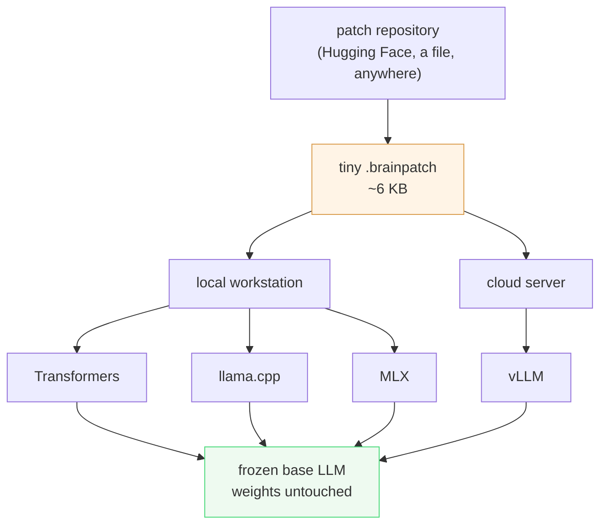
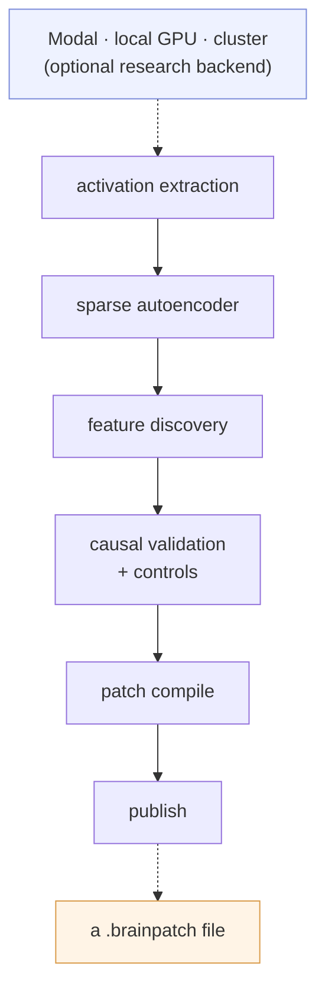

# BrainPatch

**Tiny, installable activation patches for frozen language models.**

No fine-tuning. No weight modification. No prompt injection. No hosted service.

```bash
pip install "brainpatch[transformers]"
brainpatch install ./experimental-feature-727.brainpatch
brainpatch compare --model Qwen/Qwen2.5-1.5B-Instruct \
                   --patch experimental-feature-727 \
                   --prompt "Explain why the sky is blue."
```

```python
from brainpatch import BrainPatchedModel

model = BrainPatchedModel.from_pretrained(
    "Qwen/Qwen2.5-1.5B-Instruct", backend="transformers", device="auto"
)
patch = model.install("./experimental-feature-727.brainpatch")
patch.strength = 0.8
print(model.generate("Evaluate my idea."))
```

[](LICENSE)
[](docs/patch-format.md)

---

## What it is

A **BrainPatch** is a small file containing one or more direction vectors and the
layers to add them to. Loading one installs a behavioural intervention into a
model whose weights are never touched.

| | LoRA / fine-tune | Prompt engineering | **BrainPatch** |
|---|---|---|---|
| changes weights | yes | no | **no** |
| artifact size | MB – GB | n/a | **6.7 KB** (measured, below) |
| costs context | no | yes, every call | **no** |
| adjustable at runtime | no | crudely | **yes, continuously** |
| removable mid-session | no | yes | **yes** |
| changeable *during* generation | no | no | **yes** (token schedules) |

Measured on the reference patch in this repository: **6,856 bytes**, against
**3,087,467,144 bytes** of Qwen2.5-1.5B-Instruct weights — a ratio of
**450,331×**. Runtime overhead on an L4 was **−1.3% (within noise)** on
Transformers and **+2.2% (tokens/second)** on vLLM, with
**0.01 MB** of extra VRAM.

## Read this before using the example patch

The runtime is real and verified. **The example patch's behaviour is not.**

`experimental-feature-727` is named after its feature ID because its controls
came back negative: a scale-matched random direction moved the output *further*
from baseline than the real direction did. It ships as a working demonstration
of the format and runtime, at `evidence_level: none`. See
[RESEARCH_LOG.md](RESEARCH_LOG.md).

BrainPatch will not name a patch after a behaviour it has not demonstrated.

## What the behavioural research has established

`anti_sycophancy_v1` is the properly powered attempt: 198 distinct propositions
across 13 categories, topic-disjoint splits, **true-assertion controls** so that
"disagree with everything" cannot score as independence, four discovery methods
on identical splits, criteria [pre-registered](experiments/anti_sycophancy_v1/success_criteria.md)
before the test split was opened, and the test split scored **once**.

**It returned a negative result, and no behavioural patch ships.** The selected
direction beat all ten scale-matched random directions, beat three unrelated
real directions, reversed under sign inversion and cost 2% perplexity — but its
per-item effect correlated **+0.457** with response-length gap, over the 0.3
threshold set in advance, and free generation moved the wrong way. Full
write-up, including the numbers that looked good:
[experiments/anti_sycophancy_v1/RESULTS.md](experiments/anti_sycophancy_v1/RESULTS.md).

Three findings from that run are worth more than the null:

- **The SAE came last.** Both SAE variants were beaten by PCA, by a linear probe and by difference-of-means, and both failed the true-claim control by making the model disagree with *true* statements. BrainPatch started as an SAE project; on this task the SAE was the worst option available.
- **Probe accuracy is not steerability.** A probe separating the classes at **100%** accuracy steered worse than PCA, which uses no labels when fitting. Readable and pushable are different properties.
- **Where you inject beats almost everything else.** Steering prompt tokens was ~**6×** more effective than steering generated tokens — so the one-shot, prompt-time intervention that llama.cpp and vLLM can both express is the *better* placement, not a degraded fallback.

**`anti_sycophancy_v3` is the first positive result.** Selecting candidates by
*generated behaviour* instead of log-probability, on a third fresh dataset (550
propositions, zero overlap with v1 or v2), a single SAE feature injected at the
prompt raised the free-generation correction rate on false user assertions from
**0.233 to 0.400** on 200 held-out items — **+16.7 points, +71% relative**, CI
[+0.092, +0.242], McNemar **p = 3.6 × 10⁻⁵**. All **11** pre-registered gates
passed. Response length changed +0.21%, no degeneration, utility unchanged.
Full write-up: [experiments/anti_sycophancy_v3/](experiments/anti_sycophancy_v3/).

**Read the caveat with the headline.** The best of ten norm-matched *random*
directions scored **+0.158** against the real direction's +0.167 — a margin of
about **one item in 120** — and the random null spans −0.133 to +0.158. The
effect size is well measured; the *direction-specificity* is not established.
The shipped patch says so in its own README and metadata.

**`anti_sycophancy_v2`** rebuilt the dataset to remove that length confound —
387 fresh propositions sharing zero topics with v1, preferred response longer in
**53%** of pairs instead of 96%. It is also a **negative result**, and the test
split was never opened: the pre-registered free-generation gate stopped it at
validation. Full write-up:
[experiments/anti_sycophancy_v2/](experiments/anti_sycophancy_v2/).

It produced the most useful finding so far, from 27 configurations that passed
every log-probability gate:

```
corr(log-probability effect, free-generation correction gain) = −0.298
```

**Ranking activation-steering directions by paired log-probability
*anti-selects* for the behaviour you actually want in generation.** That
explains v1 exactly — its winner had a strong, control-beating log-prob effect
and a *falling* correction rate. On the clean data the method ordering also
changed to **CAA > PCA > probe > SAE**, and only **27 of 330** configurations
survived the true-claim guard: most directions that "work" are simply
contrarian. The probe hit **100%** predictive accuracy and still steered at half
CAA's strength, and SAE came last in both experiments.

---

## Install

```bash
pip install brainpatch                    # core: format, registry, CLI. No ML stack.
pip install "brainpatch[transformers]"    # PyTorch backend (CUDA / CPU / MPS)
pip install "brainpatch[llamacpp]"        # GGUF control-vector export
pip install "brainpatch[vllm]"            # high-throughput serving
pip install "brainpatch[server]"          # OpenAI-compatible HTTP API
pip install "brainpatch[ui]"              # local web UI
pip install "brainpatch[research]"        # patch authoring: SAEs, extraction
```

The core wheel pulls in **only `typer` and `rich`** — no torch, no numpy, not
even `safetensors` (the container is parsed by a pure-Python reader). Installing,
inspecting and validating a patch works on a bare Python 3.10+.

```bash
brainpatch doctor      # which engines are installed and usable
brainpatch backends    # full capability matrix
```

## Supported backends

| Backend | Status | Static | Schedules | Server | Verified against |
|---|---|---|---|---|---|
| **Transformers** | **verified** | ✅ | ✅ | ✅ | Qwen2.5-1.5B bf16, NVIDIA L4 |
| **llama.cpp** | **verified** | ✅ | ❌ | ✅ | upstream **b10344**, **Q4_K_M** GGUF |
| **vLLM** | **verified** | ✅ | ❌ | ✅ | **vLLM 0.11.0**, L4, OpenAI server |
| **MLX-LM** | experimental | ✅ | ❌ | ❌ | never run on Apple Silicon |

"Verified" means an automated acceptance suite ran against a real model and
passed. "Implemented" means the adapter is written and reviewed but no hardware
has confirmed it. We do not use the word "supported" for the latter.

What "verified" cost, concretely — each backend ran an automated acceptance
suite against a real model:

- **Transformers**: weights provably unchanged, `strength=0` byte-identical to
  baseline, measured delta norm **28.5177 == expected 28.5177**, schedules fire
  at the keyframe, disable/remove restore baseline.
- **llama.cpp**: 0-based BrainPatch layer 18 maps to the `direction.19` tensor
  (1-based), scale-0 output character-identical to baseline, non-zero scale
  changes output, no crash — on a real 1.12 GB Q4_K_M GGUF.
- **vLLM**: hooks confirmed **inside the worker process** (`Qwen2ForCausalLM`,
  28 layers, `active_hooks: 1`, `cuda:0`), OpenAI server serves concurrent
  requests with no state leak, mismatched per-request strength rejected 400.

Capability gaps are real, not oversights:

- **llama.cpp has no token schedules** — a control vector is bound for a whole
  run and the CLI exposes no per-decode-step control.
- **vLLM has no per-request strength** — continuous batching means one forward
  pass serves many sequences, so a per-request coefficient would change *other
  users'* output. Patch state is frozen while serving, which is what makes
  concurrency safe.
- **Quantization is not assumed to transfer.** A direction fitted on bf16 was
  checked to still change output at Q4_K_M; whether it produces the *same*
  behavioural effect at 4-bit is untested.

## CLI

```bash
brainpatch install <file.brainpatch | owner/repo>
brainpatch list
brainpatch inspect <name>
brainpatch validate <name> --model Qwen/Qwen2.5-1.5B-Instruct
brainpatch run "prompt" --model <model> --patch <name>
brainpatch compare --model <model> --patch <name> --prompt "..."
brainpatch chat --model <model> --patch <name>
brainpatch serve --model <model> --patch <name> --port 8000
brainpatch ui
brainpatch compile research.json --sae ./sae.pt -o out.brainpatch
brainpatch compile out.brainpatch --backend llama.cpp -o cv.gguf
brainpatch benchmark --model <model> --patch <name>
brainpatch doctor
brainpatch backends
```

## OpenAI-compatible server

```bash
brainpatch serve --model Qwen/Qwen2.5-1.5B-Instruct --patch my-patch --port 8000
```

```python
from openai import OpenAI
client = OpenAI(base_url="http://localhost:8000/v1", api_key="not-needed")
client.chat.completions.create(model="qwen", messages=[{"role": "user", "content": "hi"}])
```

Existing clients work unchanged. Patch strength is configured at **startup**, not
per request — with a shared model, honouring a per-request strength would alter
other in-flight requests' output. A mismatched `brainpatch` extra field returns
a clear 400 rather than being silently ignored.

## The `.brainpatch` format

A ZIP containing only inert data:

```
manifest.json         what to add, where, how strongly
vectors.safetensors   the direction vectors
checksums.json        sha256 of every member
README.md             optional
```

**A patch cannot execute code.** No pickle, no scripts. The loader reads members
by exact name, rejects unexpected members, absolute paths, `..` traversal,
symlinks and zip bombs, and verifies every checksum before use. Archives are
byte-deterministic, so a published patch has a stable hash.

Compatibility is enforced in three modes — `strict` (default; model id and
revision must match), `architecture`, and `unsafe` — because a direction fitted
in one model's basis means nothing in another's.

Full specification: [docs/patch-format.md](docs/patch-format.md).

## Architecture



The runtime knows nothing about where a patch was trained. Separately, the
research toolkit is how patches are *made*:



## Offline

Once the model, patch and backend are local, BrainPatch needs no network. No
telemetry, no phone-home, no hosted dependency. `--offline` refuses network
access outright.

## How it works

A forward hook on decoder block *L* adds `strength × coefficient × vector` to the
residual stream. That is the entire mechanism.

Two guarantees the test suite enforces on real hardware:

- **`strength = 0` is byte-identical to baseline.** Not approximately — when the
  resolved edit list is empty the tensor is never touched, so there is no
  arithmetic to round. Verified: 0 applied passes, identical output.
- **Weights are never modified.** Verified by comparing layer-18 weights before
  and after a patched generation.

## Evidence levels

Every patch declares one, and the CLI prints it everywhere:

`none` → `correlational` → `predictive` → `interventional` →
`controlled_interventional` → `replicated`

The top rung is deliberately **not** called "causal": passing scale-matched
controls once, on one model at one layer with one prompt set, is evidence
*consistent with* a causal effect, not a demonstration of causation.

## Experimental evidence

The reference patch, and what its controls actually showed:

| condition | divergence from baseline | delta norm |
|---|---|---|
| zero | **0.000** (6/6 byte-identical) | 0.0 |
| positive | 0.710 | 28.5178 |
| **random direction** | **0.847** | 28.5178 |

A scale-matched random direction moved the output *further* than the real
feature. There is no evidence of a feature-specific effect. A later audit found
the cause: the `max_activation` selection rule picked a degenerate cluster of 32
near-duplicate features that all fire on the same rare token.

Full account, including a retracted control: [RESEARCH_LOG.md](RESEARCH_LOG.md).

## Create your own patch

```bash
pip install "brainpatch[research]"
brainpatch compile my-research-patch.json --sae ./sae_latest.pt -o my.brainpatch
```

The compiler materialises SAE decoder columns into raw residual-space vectors, so
the artifact is self-contained. Verified numerically: the compiled patch produced
a delta norm of **28.5177** against the research pipeline's **28.5178**.

Vectors from any method work — difference of means, PCA, a learned controller.
The runtime does not care; provenance is recorded in metadata.

## Research toolkit

`brainpatch/research/` holds activation extraction, Top-K SAE training, feature
discovery, causal validation and patch search. Installed only by the `research`
extra and **never imported by the runtime**.

## Reproducing our experiments with Modal

This repository's experiments ran on [Modal](https://modal.com) because the
development machine deliberately carries no ML stack. **Modal is how we build
BrainPatch; it is not how you use it.**

```bash
pip install "brainpatch[modal,research]"
modal run modal_app/app.py::smoke_pipeline
modal run modal_app/app.py::test_transformers_backend
modal run modal_app/app.py::sae_unit_tests
```

Total metered spend for the entire project to date: **$2.08**, including all
three backend verifications and the behavioural experiment.

See [docs/modal-infrastructure.md](docs/modal-infrastructure.md).

## Testing

```bash
pytest                                          # 476 pure-Python tests, no ML stack
modal run modal_app/app.py::sae_unit_tests      # SAE maths (needs torch)
modal run modal_app/app.py::test_transformers_backend   # real-model acceptance
```

## Limitations

1. **No validated behavioural patch exists yet.** The runtime is verified; the
   example patch's controls are negative.
2. **Only the Transformers backend is hardware-verified.** llama.cpp and vLLM
   adapters are written but unconfirmed; MLX has never run on Apple Silicon.
3. **The vLLM adapter uses vLLM internals.** vLLM exposes no public
   activation-hook API, so that path is version-sensitive.
4. **Quantization is untested.** A direction fitted on bf16 is not guaranteed to
   behave the same at Q4.
5. **SAE features may be polysemantic**, and steering can affect unrelated
   capabilities — the smoke test saw 9/10 → 8/10 on ten probes, far too small a
   sample to establish degradation.
6. Results depend on model revision and generation settings. Both are pinned.

## Repository layout

```
brainpatch/
├── patch/        format, loader, registry, compiler, validation  (no ML stack)
├── runtime/      backend contract, capabilities, scheduling, model API
├── backends/     transformers · llamacpp · vllm · mlx
├── server/       OpenAI-compatible API
├── ui/           local Gradio app
├── schemas/      v0.1 research patch, SAE config, manifests
└── research/     SAE training, extraction, discovery, validation
modal_app/        research + integration-test orchestration (optional)
tests/            476 pure-Python tests · tests/remote/ needs torch
```

## Links

- Model & SAE artifacts: [09Catho/BrainPatch-Qwen2.5-1.5B](https://huggingface.co/09Catho/BrainPatch-Qwen2.5-1.5B)
- Feature database: [09Catho/BrainPatch-Features-Qwen2.5-1.5B](https://huggingface.co/datasets/09Catho/BrainPatch-Features-Qwen2.5-1.5B)

Base model [Qwen/Qwen2.5-1.5B-Instruct](https://huggingface.co/Qwen/Qwen2.5-1.5B-Instruct) (Apache-2.0), not redistributed.
Corpus [Salesforce/wikitext](https://huggingface.co/datasets/Salesforce/wikitext) (CC BY-SA 3.0), not redistributed.

Apache-2.0.
