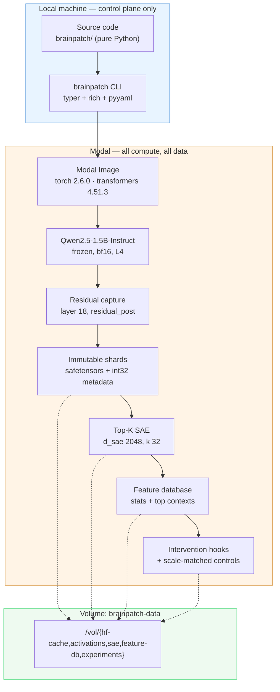

# BrainPatch

**Experimental framework for tiny, installable behavioural modifications to frozen language models, using activation-space interventions instead of prompting or fine-tuning.**

[](LICENSE)
[](https://modal.com)
[](https://huggingface.co/Qwen/Qwen2.5-1.5B-Instruct)

---

## Read this first

BrainPatch v0 is **verified infrastructure with a negative behavioural result.**

The end-to-end pipeline works and is reproducible: Modal → Qwen → activation hook → sharded storage → Top-K SAE → feature database → intervention → controls. Every number in this README was measured on Modal; none are estimates unless labelled as such.

The behavioural claim does **not** hold. In the `smoke_v0` intervention experiment, steering the selected SAE feature moved the model's output away from baseline — but a **scale-matched random direction of identical L2 norm moved it further**. There is no evidence that the feature direction carries specific behavioural meaning at this scale.

That is why this repository ships `patches/experimental-feature-727.json` and not `patches/anti-sycophancy.json`.

---

## What BrainPatch is

A BrainPatch is a small JSON file describing an intervention on one model's residual stream at one layer:

```json
{
  "name": "experimental-feature-727",
  "base_model": "Qwen/Qwen2.5-1.5B-Instruct",
  "model_revision": "989aa7980e4cf806f80c7fef2b1adb7bc71aa306",
  "sae": { "reference": "smoke_v0", "layer": 18, "hook": "residual_post",
           "d_in": 1536, "d_sae": 2048, "input_scale": 0.5610531069008018 },
  "features": [{ "feature_id": 727, "strength": 16.0 }],
  "evidence_level": "none"
}
```

Applying it adds `strength × unit_decoder_direction / input_scale` to the residual stream at layer 18. The base model's weights are never touched.

## What BrainPatch is **not**

- **Not** evidence that SAE features are human concepts. A feature is a direction that helps reconstruct activations sparsely. Nothing more is established by that.
- **Not** a claim that steering demonstrates beliefs, intentions, or any mental property.
- **Not** a source of validated behavioural labels. Every feature description in this repo is a *hypothesis* and is marked as one. `evidence_level` never advances past `correlational` automatically.
- **Not** free of side effects. Feature entanglement is expected; interventions damage unrelated capabilities. We measured a drop from 9/10 to 8/10 on capability probes at the strength used.
- **Not** portable across models, layers, or SAEs. Feature IDs are meaningless outside the SAE that produced them, and the format refuses mismatched application.
- **Not** independent of generation settings or model revision. Both are pinned and recorded.

---

## Why BrainPatch exists

Prompting is fragile and consumes context. Fine-tuning is expensive, changes weights globally, and produces artifacts measured in gigabytes. Between them sits a gap: interventions that are **small** (a few floats), **inspectable** (you can read the file), **composable**, and **dynamically controllable at generation time**.

Whether that gap can be filled usefully is an open research question. BrainPatch is the apparatus for asking it, plus an honest report of the first answer.

---

## Architecture



### The local/remote boundary

The local machine never runs a model, never downloads weights, and never installs the ML stack. This is enforced, not merely intended:

- `brainpatch/` (pure Python) and `brainpatch/ml/` (torch) are separate. `import brainpatch` works with `torch` blocked at the import hook.
- `tests/conftest.py` installs a meta-path blocker that fails any local test importing `torch`, `transformers`, or `datasets`.
- `tests/test_import_boundary.py` AST-parses every `modal_app/*.py` to assert no module-scope heavy imports (the `modal` CLI imports those files locally).
- `brainpatch run` refuses to execute a model and exits 2, pointing at the remote entry points.

---

## Setup

**Local requirements:** Python ≥ 3.10, the Modal CLI, and about 5 MB of dependencies. That is all.

```bash
git clone https://github.com/09Catho/BrainPatch.git
cd BrainPatch
pip install -e ".[modal,dev]"
```

Modal resources this project expects:

| Resource | Name |
|---|---|
| Environment | `brainpatch-dev` |
| Volume | `brainpatch-data` (mounted at `/vol`) |
| Secret | `huggingface-secret` (exposes `HF_TOKEN`) |

```bash
brainpatch modal status
```

The Hugging Face token is only ever read inside Modal containers, from the Secret. It is never hardcoded, logged, written to the Volume, or committed.

---

## Quickstart

Every command below was executed against this repository; none are illustrative.

```bash
modal run modal_app/app.py::cpu_smoke
```

```bash
modal run modal_app/app.py::gpu_info
```

```bash
modal run modal_app/app.py::smoke_pipeline
```

The full pipeline, stage by stage, if you prefer to drive it yourself:

```bash
modal run modal_app/app.py::cache_model
```

```bash
modal run modal_app/app.py::verify_cached_model --layer 18
```

```bash
modal run modal_app/app.py::extract_activations --experiment smoke_v0 --target-tokens 20000
```

```bash
modal run modal_app/app.py::train_sae --experiment smoke_v0 --d-sae 2048 --k 32 --epochs 60
```

```bash
modal run modal_app/app.py::analyze_features --experiment smoke_v0
```

```bash
modal run modal_app/app.py::intervention_smoke --experiment smoke_v0
```

```bash
modal run modal_app/app.py::sweep_strength --experiment smoke_v0
```

```bash
modal run modal_app/app.py::intervention_experiment --experiment smoke_v0 --strength 16
```

Local, lightweight commands:

```bash
brainpatch list
```

```bash
brainpatch inspect patches/experimental-feature-727.json
```

```bash
brainpatch validate patches
```

```bash
pytest
```

---

## Activation extraction

One residual-stream site, configurable, validated against the model's real depth rather than assumed.

```
/vol/activations/smoke_v0/
├── manifest.json              provenance, shard index, resume state
├── examples.jsonl             text stored once, referenced by index
└── shard_000000.safetensors   activations [N, 1536] bf16 + meta [N, 3] int32
```

Design decisions that matter:

**Immutable shards.** A shard recorded in the manifest is never rewritten. A run that dies mid-shard leaves an unrecorded partial file the next run overwrites; committed work is safe. Resume is the default, `--force` is required to discard.

**No string duplication.** Each activation row carries `(example_index, token_position, token_id)` as int32 — 12 bytes. Storing surrounding text per token would multiply the corpus size several-fold. Measured cost: **3084.01 bytes/token**, exactly `1536 × 2 + 12`.

**Position 0 is dropped.** The first token of a decoder-only transformer is an attention sink. Measured at layer 18 of Qwen2.5-1.5B: **activation norm 11052 at position 0 against a corpus mean of ~70** — a factor of 156. Including it would dominate the input-scale normalisation and waste dictionary capacity on a positional artifact.

**Padding is masked out.** Blocks of differing length are right-padded for batching, then padded positions are excluded before storage.

---

## SAE training

```
z_pre = W_enc @ (x - b_dec) + b_enc
z     = TopK(ReLU(z_pre))          # L0 is exactly k, by construction
x_hat = W_dec @ z + b_dec
```

**Why Top-K rather than an L1 penalty.** L1 needs a coefficient whose correct value depends on activation scale, and it shrinks every activation toward zero, biasing magnitudes. Top-K makes sparsity a hyperparameter instead of an outcome. Measured L0 was exactly 32.0.

**Why unit-norm decoder columns.** Without the constraint, the network can halve every decoder column and double every activation at no cost to the loss. That is fatal for interventions specifically: a patch says "add strength 16 along feature 727's direction", and if the direction's length is arbitrary then so is the strength. Measured decoder norms after training: mean 1.0, min 0.9999992, max 1.0000007.

**Why `input_scale` is stored in the checkpoint.** Activations are normalised so `E[||x||₂] = √d_in`, so decoder columns live in normalised space. Injecting back into the raw residual stream divides by that scale. Without recording it, "strength 1.0" would mean something different for every SAE. Measured for `smoke_v0`: **0.5610531069008018**.

**Dead features.** AuxK (dead features reconstruct the residual error) is enabled at `α = 1/32`. Decoder gradients have their column-parallel component projected out before each step, so the optimizer does not fight the renormalisation.

---

## Feature discovery

`/vol/feature-db/<experiment>/features.jsonl`, one record per feature: firing rate, mean and max activation (over firing tokens only — averaging in a Top-K SAE's structural zeros would report `k/d_sae` times the true magnitude), decoder norm, and top-activating contexts recovered back to readable text.

**No feature receives a semantic label from this stage.** Every record is written with `hypothesis: null` and `evidence_level: "none"`. The evidence ladder is:

| Level | Means |
|---|---|
| `none` | no description offered |
| `correlational` | top-activating contexts look suggestive — nothing more |
| `predictive` | activation predicts a behaviour on held-out data |
| `interventional` | steering changes behaviour, controls not yet complete |
| `causal` | steering changes behaviour **and** scale-matched controls do not |

Only the validation pipeline writes anything above `correlational`, and it does so from measurements.

---

## Interventions

```python
from brainpatch import BrainPatchedModel

model = BrainPatchedModel.from_pretrained("Qwen/Qwen2.5-1.5B-Instruct")
model.load_sae("/vol/sae/smoke_v0/sae_latest.pt", reference="smoke_v0")

model.install("patches/experimental-feature-727.json")
model.set_patch_strength("experimental-feature-727", 1.5)

print(model.generate("Solve this problem..."))
```

Ad-hoc exploration:

```python
model.add_feature(layer=18, feature_id=727, strength=16.0)
```

### Dynamic token-level steering

Strength can change partway through a single generation, keyed on **generated**-token index (the prompt is not counted):

```python
from brainpatch.steering import StrengthSchedule

model.set_patch_schedule("experimental-feature-727", StrengthSchedule({0: 0.0, 24: 1.0, 48: 2.0}))
```

Measured during a real generation on Modal:

| generated token | delta norm |
|---|---|
| 0 – 23 | 0.0 |
| 24 | 28.5178 |
| 48 | 57.0356 |

Maximum absolute error against the predicted schedule: **3.6 × 10⁻⁶**.

### `strength = 0` is exactly baseline

Not approximately. When every coefficient resolves to zero the plan returns an empty edit list, the hook returns `None`, and the tensor is never touched — there is not even a floating-point round trip to differ on. Verified empirically: **6/6 prompts byte-identical**, with `applied_passes = 0`.

This matters because if it were merely *close*, every "baseline" in every experiment would be contaminated.

---

## BrainPatch format

Validation refuses, loudly:

- a different base model (`PatchCompatibilityError`)
- a mismatched hidden size
- a layer beyond the model's depth
- a different SAE reference or dictionary size
- a revision mismatch, under `strict_revision=True`
- duplicate feature IDs, out-of-range IDs, unknown edit modes, unknown evidence levels, malformed schedules

Applying a Qwen patch to Gemma is not "degraded performance" — it is adding an arbitrary vector to an unrelated coordinate system. See [`docs/patch-format.md`](docs/patch-format.md).

---

## Causal validation

Seven conditions per prompt, identical generation settings throughout:

| Condition | Purpose |
|---|---|
| `baseline` | no hook installed |
| `zero` | hook installed at strength 0 — must equal baseline |
| `positive` / `negative` | the feature direction at ±strength |
| `random_positive` / `random_negative` | a random unit direction, **same L2 norm** |
| `unrelated_positive` | a different *real* feature, same strength |

The random control isolates *is this direction special*. The unrelated-feature control isolates *is this feature special, or would any dictionary direction do this*. Because decoder columns and random directions are both unit-norm and share the coefficient path, injected deltas have **identical** norms by construction — the control differs only in direction.

Every generation is stored. No filtering, no best-of, no cherry-picking.

```
/vol/experiments/smoke_v0_intervention/
├── config.json  baseline.jsonl  interventions.jsonl
├── controls.jsonl  all_generations.jsonl
└── metrics.json  report.md
```

---

## Measured results — `smoke_v0`

### Environment

| | |
|---|---|
| GPU | NVIDIA L4, compute capability 8.9, 58 SMs, 22.03 GB VRAM |
| Stack | torch 2.6.0+cu124, CUDA 12.4, cuDNN 9.1.0, bf16 supported |
| GPU correctness | matmul max abs error vs CPU reference: **0.0** |
| Base model | Qwen2.5-1.5B-Instruct @ `989aa7980e4cf806f80c7fef2b1adb7bc71aa306` |
| Discovered architecture | hidden 1536, 28 decoder blocks |

### Model caching

| | |
|---|---|
| Download (CPU container) | 2.886 GB, 10 files, 64.6 s |
| Load from Volume cache (L4, separate invocation) | **7.72 s** |
| Model load peak VRAM | 2945.3 MB |
| Inference peak VRAM | 2955.2 MB |

### Extraction

| | |
|---|---|
| Tokens | 20,000 (layer 18, `residual_post`, seq len 256, batch 8) |
| Wall time | 8.367 s → **2390.4 tokens/s** |
| Storage | 58.8 MB, 1 shard, **3084.01 bytes/token** |
| Peak VRAM | 3553.4 MB |

### SAE training

| | |
|---|---|
| Architecture | d_in 1536, d_sae 2048 (expansion 1.33×), k 32, 6,295,040 params |
| Training | 2220 steps / 60 epochs, 78.6 s → **28.229 steps/s** |
| Peak VRAM | **295.4 MB** |
| Train | explained variance **0.762**, cosine 0.925, normalised MSE 0.145 |
| Validation | explained variance **0.658**, cosine 0.890, normalised MSE 0.211 |
| L0 | exactly 32.0 |
| Dead features | 0 of 2048 |
| `input_scale` | 0.5610531069008018 |

The **0.104 train/validation gap in explained variance is real overfitting**, and expected: 19,000 training rows against a 2048-feature dictionary is far too little data. `smoke_v0` exists to prove the pipeline, not to produce a good SAE.

### Dose–response sweep (feature 727)

| strength | delta norm | divergence from baseline | degenerate |
|---|---|---|---|
| 2 | 3.565 | 0.434 | no |
| 4 | 7.129 | 0.443 | no |
| 8 | 14.259 | 0.563 | no |
| 16 | 28.518 | 0.770 | no |
| 32 | 57.036 | 0.958 | **yes** (see note) |
| 64 | 114.071 | 1.000 | **yes** |

Residual-stream L2 norm at layer 18 is roughly 70 in raw units, so strength 16 is a ~41% perturbation. Below strength 8 the greedy output was unchanged on the probe prompt.

> **Note on the strength-32 row.** The degeneration detector originally scored this as clean. The generation was `"as they encounter each other, as they interact with each other, as they collide, as they merge, ..."` — plainly looping, but each clause ends differently, so set-based diversity measures missed it. A `top_bigram_fraction` metric was added in response and now flags it (0.167 vs 0.028 for healthy text). The table reflects the corrected detector.

### Intervention experiment — the headline result

Feature 727 vs unrelated feature 1270, strength ±16, 6 prompts, greedy decoding, 96 new tokens.

| condition | divergence from baseline | delta norm | degenerate |
|---|---|---|---|
| `zero` | **0.000** | 0.0 | 1/6 |
| `positive` | 0.710 | 28.5178 | 1/6 |
| `negative` | 0.731 | 28.5178 | 1/6 |
| **`random_positive`** | **0.847** | 28.5178 | 0/6 |
| `random_negative` | 0.698 | 28.5178 | 0/6 |
| `unrelated_positive` | 0.681 | 28.5178 | 1/6 |

```
positive − random_control    = −0.137     ← the wrong sign
positive − unrelated_feature = +0.029     ← negligible
```

**The scale-matched random direction moved the output further from baseline than the real feature did.** An unrelated real feature performed indistinguishably. There is no evidence of a feature-specific causal effect.

*Statistical caveat:* 6 prompts, one greedy generation per condition, no repeated sampling, no significance testing. These are not effect sizes. They are enough to say the controls did not separate — not enough to quantify anything.

### Utility retention

10 hand-written capability probes, feature 727 at strength 16:

| | baseline | patched |
|---|---|---|
| overall | 9/10 (0.90) | 8/10 (0.80) |
| arithmetic | 3/3 | 3/3 |
| factual QA | 2/3 | **1/3** |
| instruction following | 2/2 | 2/2 |
| reasoning | 2/2 | 2/2 |
| continuation length | 57.3 words | 69.7 words (1.22×) |

A one-item change on ten probes carries no statistical weight. It is directionally consistent with steering degrading unrelated capability, and nothing stronger should be read into it.

### Storage produced

| tree | size |
|---|---|
| `hf-cache/` | 5938.53 MB |
| `sae/` | 72.13 MB |
| `activations/` | 64.81 MB |
| `feature-db/` | 4.68 MB |
| `experiments/` | 0.09 MB |
| **total** | **6080.24 MB** |

---

## Demo

A Gradio UI runs on Modal — Compare, Feature Explorer, Patch Inspector — with baseline and patched output side by side, strength sliders, and schedule controls.

```bash
modal serve modal_app/web.py
```

It is deliberately **not deployed**. A permanently warm L4 inference service would consume the entire project budget in days for no research value. The container holds model and SAE across requests via `@modal.enter` and releases the GPU after 120 s idle.

---

## Reproducibility

Seeded: Python `random`, torch CPU and CUDA, dataset sampling, SAE initialisation, corpus shuffling, and the random-control directions.

Recorded with every artifact: model id and **resolved commit SHA**, layer, hook site, dtype, sequence length, token count, seed, GPU type, SAE architecture and optimizer settings, and pinned package versions.

**Known non-determinism.** GPU training is only approximately reproducible: cuDNN kernel selection and floating-point atomics make bitwise-identical reruns unlikely on a different container or driver. Generation is greedy (`do_sample=False`) throughout the experiments, which removes sampling variance from every comparison.

---

## Limitations

1. **The behavioural result is negative.** Controls did not support a feature-specific effect. Read [`RESEARCH_LOG.md`](RESEARCH_LOG.md) before drawing conclusions.
2. **The SAE is undertrained by design.** 20k activations, 2048 features, measurable overfitting.
3. **The corpus is wrong for the goal.** `wikitext` is generic prose; the model is instruction-tuned. Features useful for steering *behaviour* would more plausibly emerge from instruction-formatted data.
4. **Sample sizes are tiny.** 6 prompts, 10 utility probes, no repeats, no significance testing.
5. **Contrast sets are synthetic fixtures**, hand-written, never validated against human annotation. They are marked `synthetic: true` and the loader tests assert it.
6. **Model-free metrics are heuristics.** They already demonstrably missed one degenerate generation. A `False` means "no obvious breakage detected", not "output is fine".
7. **One layer, one model, one hook site.** No cross-layer or cross-model claims are made or supported.
8. **Polysemanticity is expected.** Even a well-trained SAE feature need not correspond to one human concept.

---

## Research roadmap

Near term, in the order that would actually move the result:

1. **More activations.** `serious_v1` is configured (500k tokens, d_sae 16384) but **not run** — it needs approval since it exceeds the 50k unapproved ceiling. See [`configs/experiments/serious_v1.yaml`](configs/experiments/serious_v1.yaml).
2. **An instruction-formatted corpus**, so features can plausibly relate to behaviour.
3. **Contrast-driven feature selection** rather than max-activation ranking. `brainpatch/ml/patch_search.py` implements it; it was not the selection rule for the result above.
4. **Statistical power** — many prompts, repeated sampling, actual significance testing.
5. **Log-probability measurement** instead of only free generation; lower variance per unit of compute.

Deliberately **not** implemented in v0: patch marketplace, automatic feature labelling, multi-layer SAEs, patch composition and conflict detection, cross-model feature alignment. The architecture leaves room for them; spending v0 compute on them before single-model steering works would be premature.

---

## Repository layout

```
brainpatch/              pure Python — imports with no ML stack
├── schemas/             patch, manifest, SAE config, feature, contrast
├── steering/            schedules and intervention planning
├── patches/             patch file I/O
├── evaluation/          model-free text metrics
├── datasets/            contrast fixture loading
├── config.py  paths.py  cli.py
└── ml/                  torch-only — executes inside Modal only
    ├── model.py  hooks.py  corpus.py  extraction.py
    ├── activation_store.py  sae.py  training.py
    ├── feature_analysis.py  intervention.py  runtime.py
    ├── generation.py  causal.py  patch_search.py  evaluation.py
modal_app/               Modal orchestration (no module-scope torch)
configs/                 extraction, sae, experiments (incl. serious_v1)
examples/contrast/       synthetic development fixtures
patches/                 honestly-named patch files
tests/                   161 pure-Python tests, no network, no GPU
docs/                    format and methodology notes
```

## Citation and attribution

Base model: [Qwen/Qwen2.5-1.5B-Instruct](https://huggingface.co/Qwen/Qwen2.5-1.5B-Instruct), Apache-2.0. Base weights are **not** redistributed here.

Corpus: [Salesforce/wikitext](https://huggingface.co/datasets/Salesforce/wikitext) (`wikitext-2-raw-v1`), CC BY-SA 3.0, derived from Wikipedia. Only derived numerical artifacts and short attributed snippets are published.

Method influences: sparse autoencoders for dictionary learning on transformer activations, and the Top-K SAE formulation with AuxK dead-feature revival.

Licensed under Apache-2.0.
